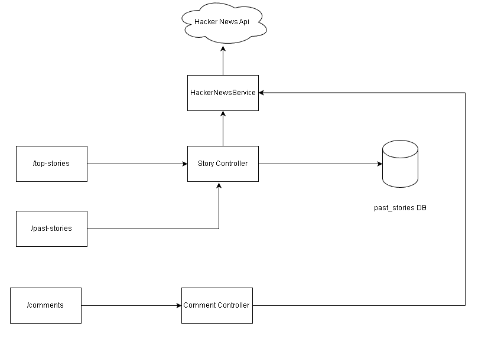

# Hacker News Service API

This project is built using Spring Boot and MySQL database. It provides APIs using the Hacker News API hosted on Firebase. The system handles GET request events triggered by story controller and comment controller, and sends out JSON data.

## Installation

To install and run this project, please follow these steps:

1. Extract the project zip file.
2. Import the project into your IDE.
3. Install MySQL database and MySQL Workbench on your local machine.
4. Execute the SQL scripts provided in the Starter-files directory sequentially using MySQL Workbench to create the necessary database schema and tables.
5. Run the main application in your IDE.

## Work Flow

1. When the application is started, the end points are available
2. When a user hits the `/top-stories` endpoint, it fetches the data from https://hacker-news.firebaseio.com/v0/topstories.json.It then navigates to each story using https://hacker-news.firebaseio.com/v0/item/storyId.json and sorts the stories based on their score.
3. We are using Caffeine Cache to store the top 10 Stories for the period of 15 minutes. The Cache will expire in 15 minutes. Any hits till then will serve the stories from the cache.
4. While continuing to run, the application stores all the past-stories in the past_stories table.
5. When a user hits the `/past-stories` endpoint, the Past Stories are served from the past_stories table.

## End Points

This project contains the following endpoints:

- `/top-stories`: Returns the top 10 stories ranked by score in the last 15 minutes.
- `/past-stories`: Returns all the past top stories that were served previously.
- `/comments/{storyId}`: Returns the top 10 parent comments on a given story (sorted by the total number of comments including child comments per thread). (Sample storyId: 35352452)

To use these endpoints, send a GET request to the appropriate endpoint with the necessary parameters, and the server will return a JSON response with the requested data.

## Dependencies

This project uses Spring Boot and MySQL database. It also relies on the Hacker News API hosted on Firebase. For more information, see the [Hacker News API documentation](https://github.com/HackerNews/API).
